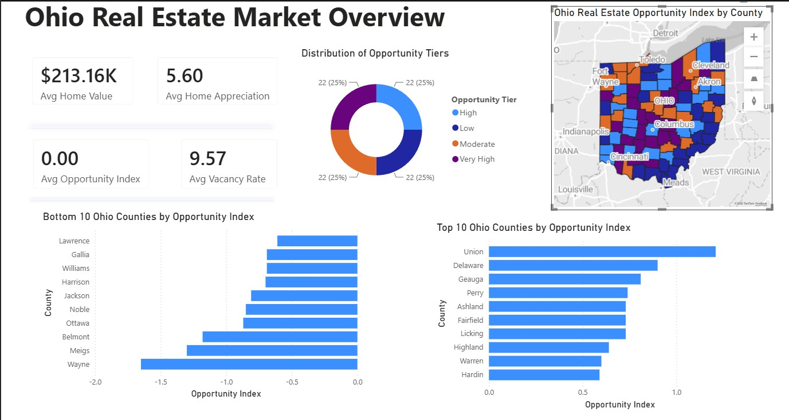
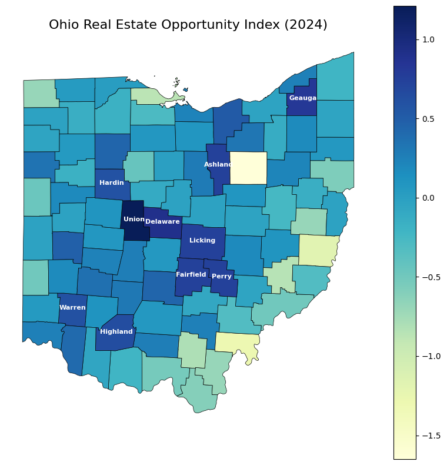
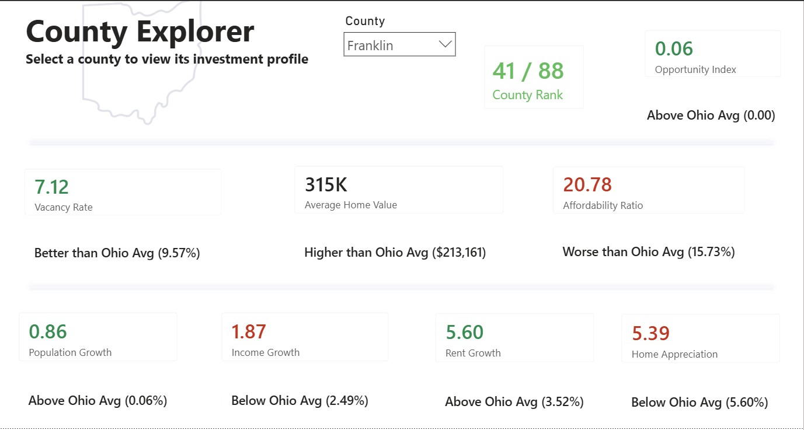

# Ohio Real Estate Opportunity Index

A county-level analytics project that identifies promising real estate investment opportunities across Ohio using demographic, economic, housing, and affordability indicators.

The project combines publicly available datasets, statistical standardization, weighted index construction, and an interactive Power BI dashboard to help compare Ohio's 88 counties from an investment perspective.

<table>
<tr>
<td align="center"><b>Dashboard Overview</b></td>
<td align="center"><b>Opportunity Index Map</b></td>
<td align="center"><b>County Explorer</b></td>
</tr>

<tr>
<td></td>
<td></td>
<td></td>
</tr>
</table>

---

## Project Overview

Real estate markets differ significantly across Ohio. While some counties experience strong population growth, rising incomes, and appreciating home values, others struggle with affordability challenges, slower economic growth, or weaker housing markets.

Rather than evaluating a single metric in isolation, this project combines multiple indicators into a unified **Opportunity Index** that provides a data-driven way to compare counties and identify markets with stronger overall investment potential.

The final results are presented through an interactive Power BI dashboard that enables county-level exploration and comparison.

---

## Objectives

The primary objectives of this project were to:

- Develop a county-level Opportunity Index for all 88 Ohio counties.
- Standardize variables with different units and scales.
- Combine multiple housing and demographic indicators into a single investment score.
- Rank counties according to overall investment attractiveness.
- Build an interactive dashboard for exploring county-level performance.
- Communicate analytical findings through intuitive visualizations.

---

## Data Sources

The analysis combines publicly available datasets from:

- American Community Survey (ACS)
- Zillow Housing Data

The final analytical dataset contains one observation for each of Ohio's 88 counties.

---

## Opportunity Index Methodology

The Opportunity Index combines six key indicators representing different aspects of a local housing market.

| Indicator | Weight |
|-----------|-------:|
| Home Price Appreciation | 25% |
| Population Growth | 20% |
| Income Growth | 20% |
| Rent Growth | 15% |
| Vacancy Rate | 10% |
| Affordability Ratio | 10% |

Each variable was standardized before applying the weighting scheme to ensure that no single metric dominated the final index because of its scale.

The weighted scores were combined into a single Opportunity Index, allowing every county to be ranked from highest to lowest investment potential.

---

## Dashboard Features

The Power BI dashboard includes two interactive pages.

### 1. Ohio Real Estate Market Overview

This page provides:

- Statewide market summary
- Opportunity Index distribution
- Interactive county map
- Top-performing counties
- Lowest-ranked counties
- Key housing market indicators

---

### 2. County Explorer

Users can select any Ohio county to view:

- County ranking
- Opportunity Index
- Home values
- Vacancy rate
- Affordability ratio
- Population growth
- Income growth
- Rent growth
- Home appreciation

Each metric is compared against the statewide average to provide additional context.

---

## Opportunity Index Map

The map illustrates the spatial distribution of Opportunity Index values across Ohio counties, highlighting regional differences in investment potential.

---

## Technologies Used

- Python
- Pandas
- NumPy
- GeoPandas
- Matplotlib
- Power BI
- DAX

---

## Future Improvements

Planned enhancements include:

- Publishing the complete Python analysis notebook.
- Performing sensitivity analysis on indicator weights.
- Adding additional economic indicators.
- Deploying the dashboard as an interactive web application.
